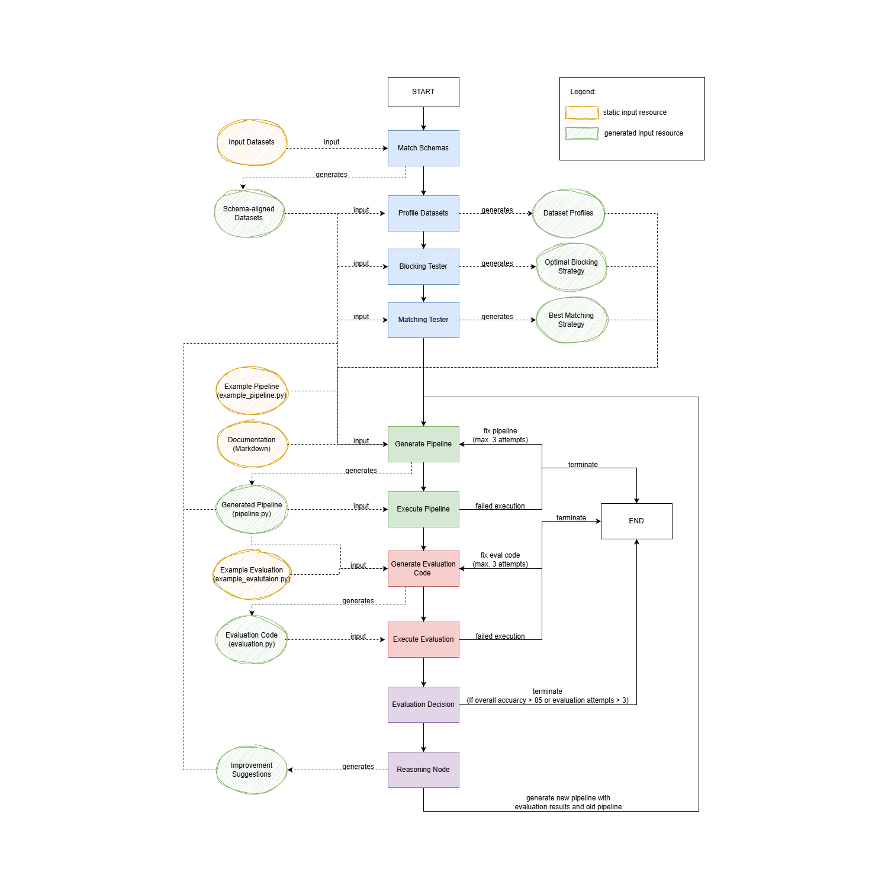

# Current Experiment Results

Current expermint results can be found [here](https://github.com/gdebus/data-integration-team-project/blob/main/ExperimentResults.md).

# Setup

To set up the virtual environment run the following commands:

**Following step is only required, if your Python is 3.13 or higher.**

```
py -3.12 --install
```

**Set up your virtual environment**

```
py -3.12.9 -m venv venv
```

```
.\venv\Scripts\activate
```

```
pip install -r .\requirements.txt
```

# API Key

Save the API key as shown below under `agents/.env`:

```
OPENAI_API_KEY=<API-KEY>
```

# Architecture



# Requirements

## Test Sets

The test sets need to meet following requirements.

### Structure

The test set **MUST** contain the columns `id1`,`id2`, and `label`. The first row of the CSV file must contain the names of the columns. It further **MUST** be ensured that all columns of the test sets are filled out. No value for e.g., `label` must be missing.

### Filename

The filename of the test sets **MUST** match the order of the id columns. E.g., if column `id1` contains the IDs from *dataset_1* and `id2` contains the IDs from *dataset_2* the test set file should be named `dataset_1_dataset_2_test.csv`. The order is important.