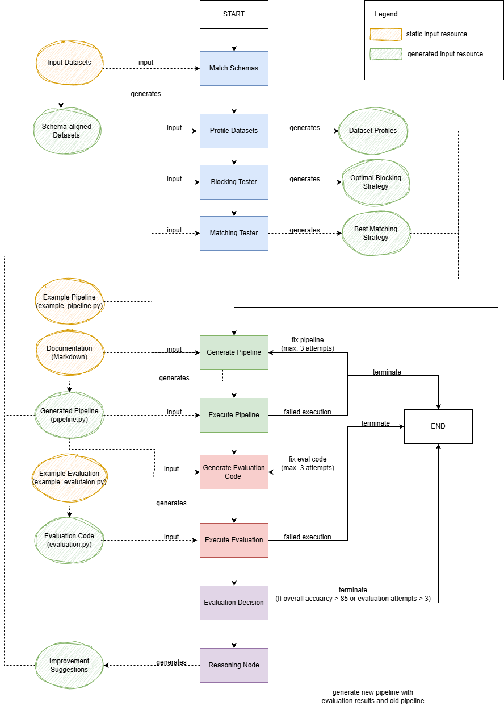

# Architecture

# Current Results

| Use Case      | Approach                                    | Overall Accuracy (RB) | Overall Accuracy (ML) |
|---------------|---------------------------------------------|-----------------------------|-----------------------------|
| Music         | [AdaptationPipeline_blocking_matching_extension_Final_Reasoning.ipynb](#agents/AdaptationPipeline_blocking_matching_extension_Final_Reasoning.ipynb)  | TBD                  | TBD                  |
| Restaurant (Test sets currently do not fit datasets)    | [AdaptationPipeline_blocking_matching_extension_Final_Reasoning.ipynb](#agents/AdaptationPipeline_blocking_matching_extension_Final_Reasoning.ipynb)  | 26.408%                  | 28.661%                  |

# Requirements

## Test Sets

The test sets need to meet following requirements.

### Structure

The test set **MUST** contain the columns `id1`,`id2`, and `label`. The first row of the CSV file must contain the names of the columns. It further **MUST** be ensured that all columns of the test sets are filled out. No value for e.g., `label` must be missing.

### Filename

The filename of the test sets **MUST** match the order of the id columns. E.g., if column `id1` contains the IDs from *dataset_1* and `id2` contains the IDs from *dataset_2* the test set file should be named `dataset_1_dataset_2_test.csv`. The order is important.