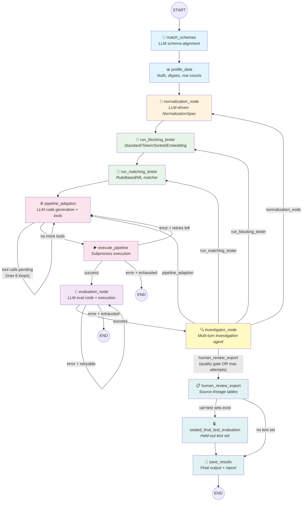
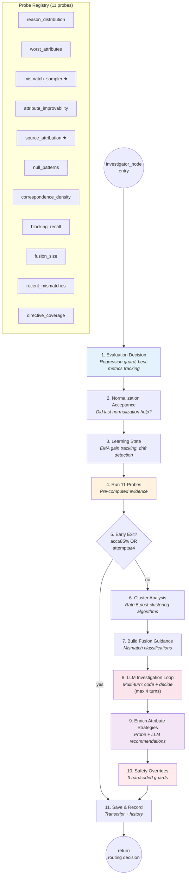
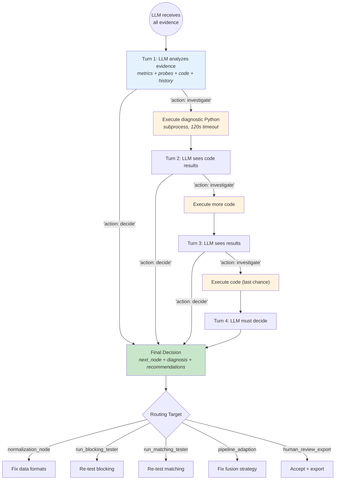
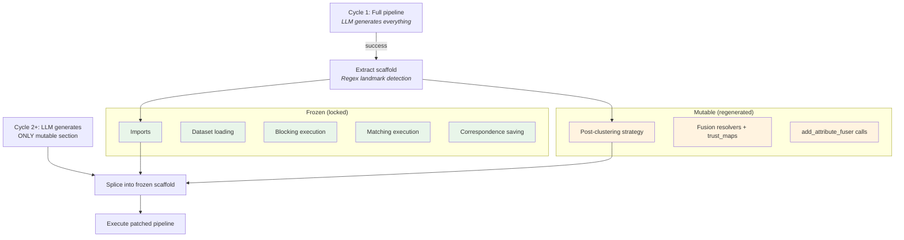
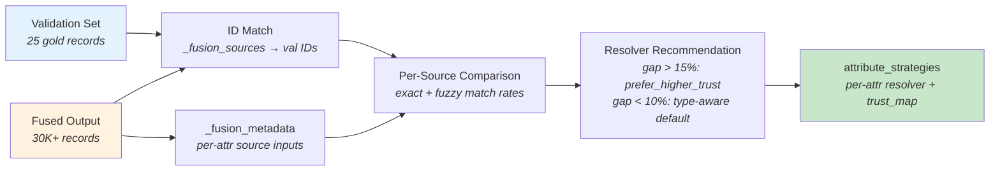

# Agent Pipeline — Architecture Diagram

## Main Graph Flow

## Investigator Node Detail

## LLM Investigation Loop Detail

## Code Guardrails Pipeline

```mermaid
graph LR
    CODE_IN["LLM-generated<br/>pipeline code"] --> g1

    g1["1. include_singletons<br/>= True"]
    g2["2. Threshold<br/>freezing"]
    g3["3. list_strategy<br/>validation"]
    g4["4. Fusion guidance<br/>enforcement"]
    g5["5. Per-attribute<br/>trust_map injection"]
    g6["6. Import<br/>safety scan"]
    g7["7. EmbeddingBlocker<br/>.block()→.materialize()"]
    g8["8. Output path<br/>rewriting"]
    g9["9. eval_id column<br/>injection"]
    g10["10. ML post-clustering<br/>safety (if ml mode)"]

    g1 --> g2 --> g3 --> g4 --> g5 --> g6 --> g7 --> g8 --> g9 --> g10

    g10 --> CODE_OUT["Guardrail-safe<br/>pipeline code"]

    style CODE_IN fill:#ffcdd2
    style CODE_OUT fill:#c8e6c9
```

## Scaffold System (Cycle 2+)

## Source Attribution Probe Flow

