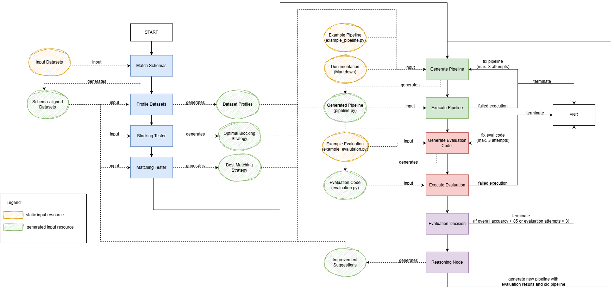

# Architecture

Our pipeline follows a modular design, separating schema matching, entity matching, and data fusion.

## Workflow Overview

1.  **Data Loading:** Ingesting datasets in various formats (Parquet, CSV).
2.  **Schema Matching:** Mapping attributes from different sources to a target schema.
3.  **Entity Matching:** Identifying records that represent the same real-world entity.
4.  **Data Fusion:** Merging matching records into a single, high-quality representation.
